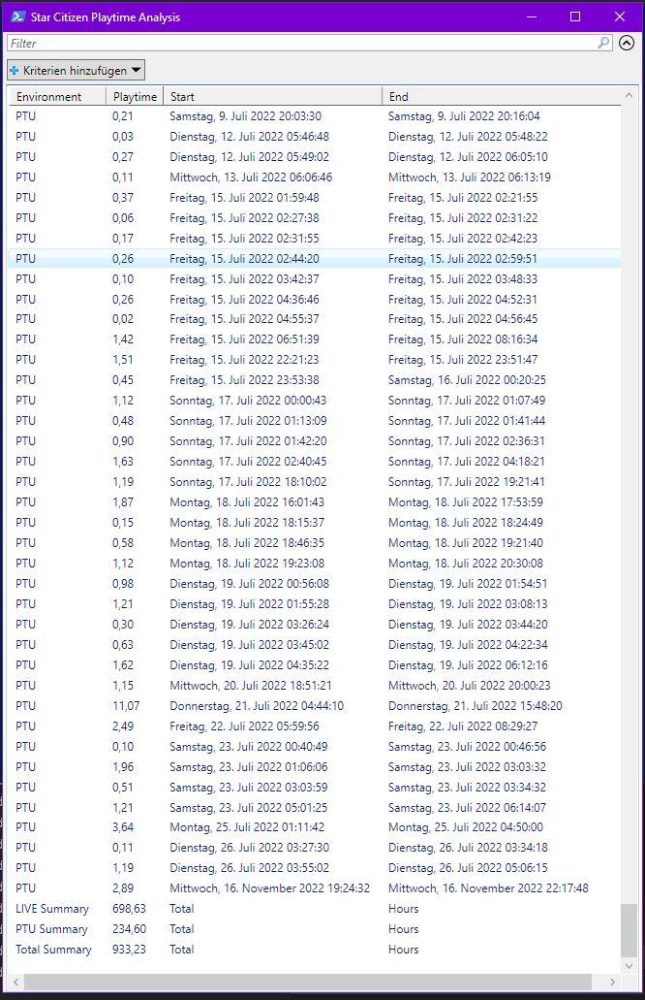

# Lookup GameDirectory Logfiles and show Playtime

PreRequests
- none, runs with Windows 10 built-in powershell v5

Usage:
- the game directory is grabbed from the launcher logfile, therefor it uses the logfiles from the last LIVE or PTU session
- download the ps1 file and run powershell the script (rightclick -> run with powershell)
- and wait for it to parse through each logfile and extract playtimes
- after all logfiles have been parsed, the total playtime is shown in the last line

Screenshots:

